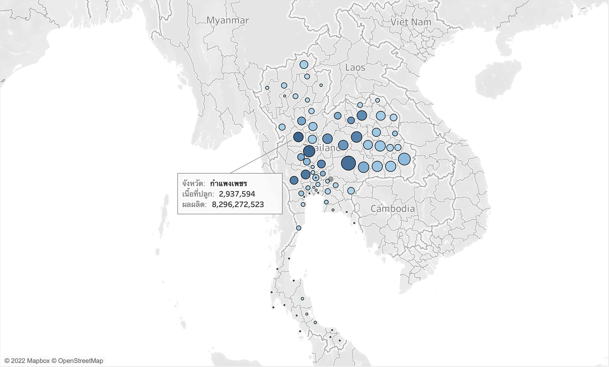
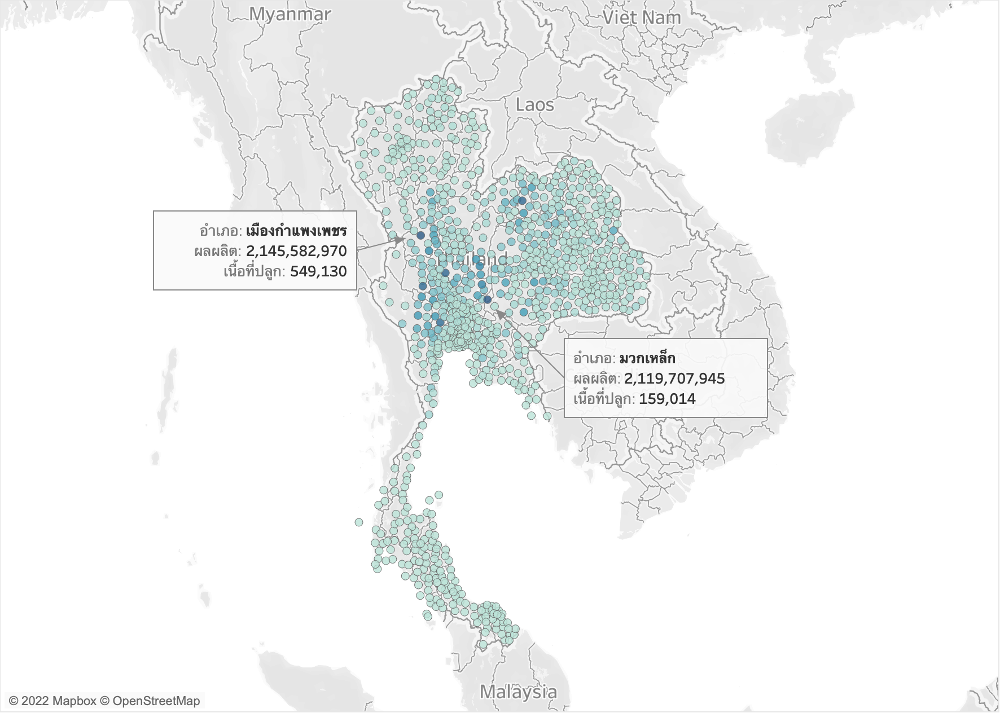
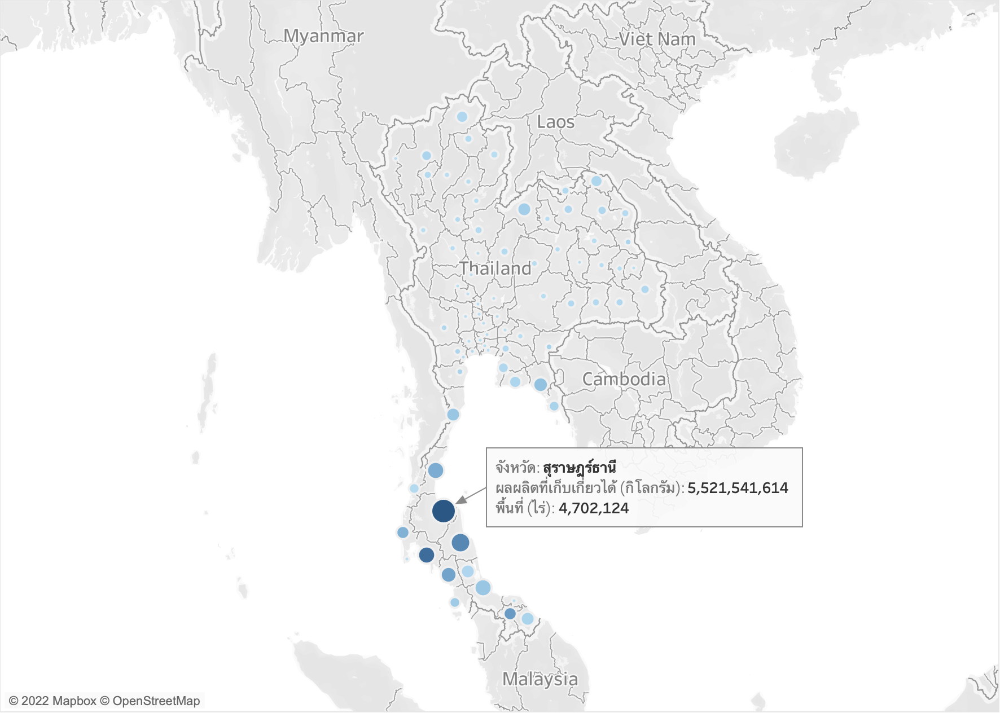
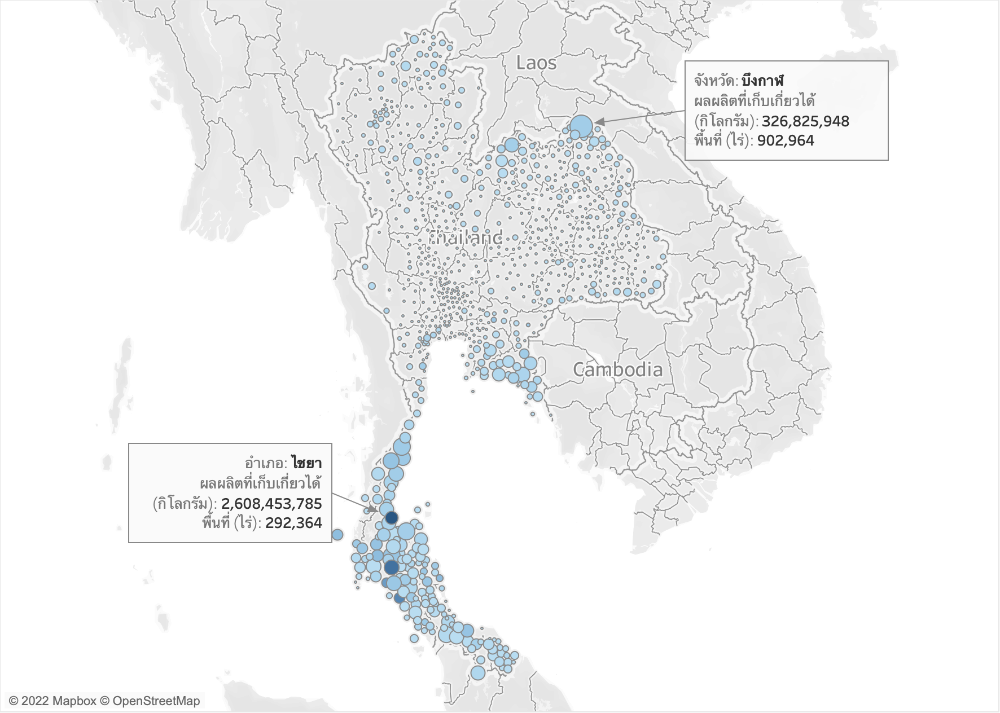

# Thai Agriculture Visualization

## Article

[แผนภูมิภูมิศาสตร์ภาคการเกษตรของไทย](https://medium.com/@reefwn/%E0%B9%81%E0%B8%9C%E0%B8%99%E0%B8%A0%E0%B8%B9%E0%B8%A1%E0%B8%B4%E0%B8%A0%E0%B8%B9%E0%B8%A1%E0%B8%B4%E0%B8%A8%E0%B8%B2%E0%B8%AA%E0%B8%95%E0%B8%A3%E0%B9%8C%E0%B8%A0%E0%B8%B2%E0%B8%84%E0%B8%81%E0%B8%B2%E0%B8%A3%E0%B9%80%E0%B8%81%E0%B8%A9%E0%B8%95%E0%B8%A3%E0%B8%82%E0%B8%AD%E0%B8%87%E0%B9%84%E0%B8%97%E0%B8%A2-e0453ebd1a40)

## Data ([data.go.th](https://data.go.th/))

1. [ข้อมูลการผลิตข้าว พืชไร่ พืชผัก ไม้ดอก ไม้ประดับ สมุนไพรและเครื่องเทศ รายตำบลทั่วประเทศ ในปี 2562](https://data.go.th/dataset/production-62)
2. [ข้อมูลการผลิตไม้ผล ไม้ยืนต้น รายตำบลทั่วประเทศ ในปี 2562](https://data.go.th/dataset/02)
3. [ข้อมูลพิกัด LAT/LONG ที่ตั้งตำบล](https://data.go.th/dataset/item_c6d42e1b-3219-47e1-b6b7-dfe914f27910)

## Visualization

#### Rice By Province

#### Rice By District

#### Fruit By Province

#### Fruit By District

## Technologies & IDE

     &nbsp;
    

